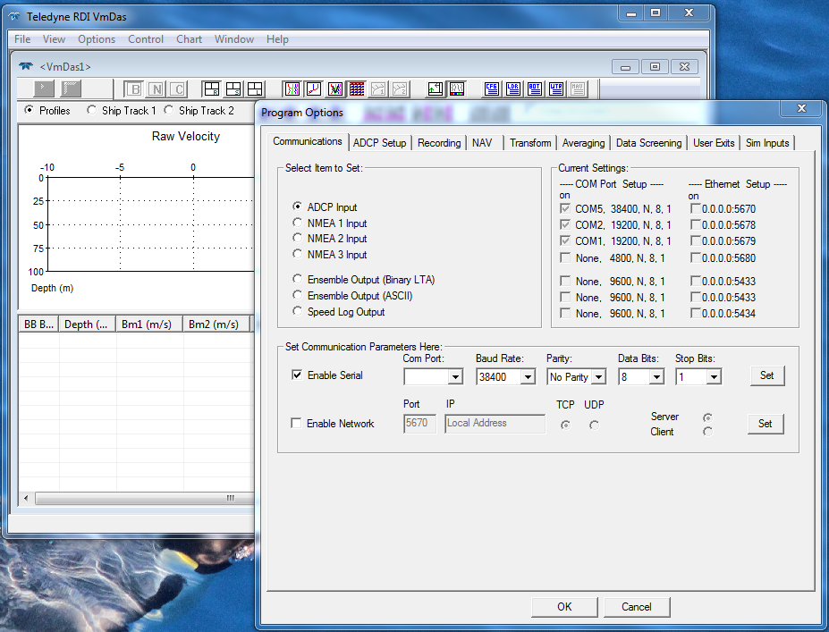
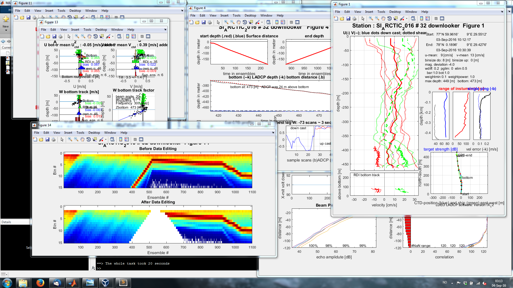
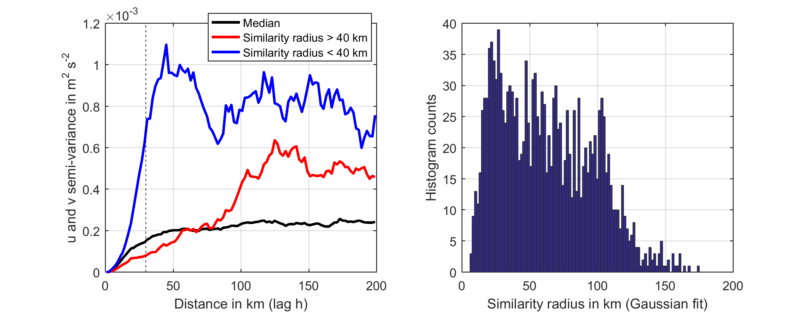
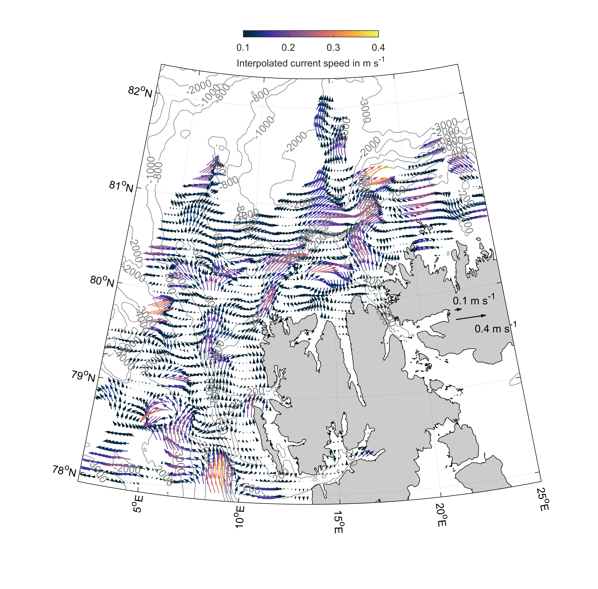

# Processing and analysis of vessel mounted and lowered ADCP datasets

This document will guide you through the steps necessary to process and  analyse both vessel mounted (VM-ADCP) and lowered acoustic doppler current profilers (L-ADCP). Both are complex data sources that contain a lot of noise and potential biases, but dont despair, with todays programms and code packages anyone can work with this data and produce meaningfull results.

We used the following data sources:

from the field:
- VM-ADCP: RDI Workhorse 75 kHz and 150 kHz (http://www.teledynemarine.com/workhorse-mariner-adcp?BrandID=16)
- L-ADCP: RDI Workhorse Sentinel 300kHz (http://www.teledynemarine.com/workhorse-sentinel-adcp?BrandID=16)
- Sea Bird 911plus CTD profiles (http://www.seabird.com/sbe911plus-ctd)

from the web:
- International Bathymetric Chart of the Arctic Ocean IBCAO (https://www.ngdc.noaa.gov/mgg/bathymetry/arctic/arctic.html)
- Global coastline dataset (https://www.ngdc.noaa.gov/mgg/shorelines/data/gshhs/)

We used the following software:

Data collection:
- VMDAS ADCP data collection software (http://www.teledynemarine.com/rdi/support#)
- BB Talk terminal software (should also work with other terminal programmes, http://www.teledynemarine.com/rdi/support#)  
- Sea Bird CDT data collection suite (Seaterm, Seasave, SBE Data processing, http://www.seabird.com/sbe911plus-ctd)

Post processing:
- Oracle VM VirtualBox 5.0 running a UNIX machine with the CODAS ADCP processing suite (https://currents.soest.hawaii.edu/docs/adcp_doc/codas_doc/)

Analysis:
- Matlab 2016a, incl. the mapping and statistics toolbox and the following additional packages
- m_map (https://www.eoas.ubc.ca/~rich/map.html)
- seawater liberary (http://www.cmar.csiro.au/datacentre/ext_docs/seawater.htm)
- objective mapping (http://mooring.ucsd.edu/software/matlab/doc/toolbox/datafun/objmap.html)
- L-ADCP processing suite LDEO (http://www.ldeo.columbia.edu/~ant/LADCP)

Here is a visualization of VM-ADCP and L-ADCP current profiles:


# Fieldwork

This section explains how ADCP data was gathered during each expedition.

## VM-ADCP

The VM-ADCP is usualy mounted in the ships hull or a retractable keel, and connected to an onboard PC. To record data one of two proramms is usually used: The Windows programm VMDAS (Vesse mounted data aquisition system) from RDI instruments or the open source suite UHDAS from the University of Hawaii.

Make sure that the PC is running with the exact UTC time. If you can, synchronize the PC clock with a GPS device, the NMEA navigation data stream or the internet. Having the correct timestamps in the ADCP data is important for the post-processing (combining the L-ADCP, VM-ADCP and CTD data).



Here we used VMDAS to collect VM-ADCP data. After starting up the PC and ensuring the PC is properly connected to the ADCP and the ships navigation channels, one can open the VMDAS and select the button: File--> Collect Data. This will open some empty diagrams. The next step is to edit the data options under: Options --> Edit data options. In the first section "Communications" the ADCP and NMEA (navigation) data channels need to be set to the right ports, but the ships technician likely did this already. In the next section "ADCP setup" you need to select the bin number and size. This depends on the frequency of the ADCP. We used 100 bins with a binsize of 8 m and 8 ms paceing between the bins. The ADCP also requires a specific set up file, which states details of the ADCPs mounting and ping-ing patters. This is usually avialable from the ships technician or stored on the data collection PC. Here is an example from RV Helmer Hanssen:

```
-----------------------------------------------------------------------------\
; ADCP Command File for use with VmDas software.
;
; ADCP type:     75 Khz Ocean Surveyor
; Setup name:    default
; Setup type:    Low resolution, long range profile(narrowband)
;
; NOTE:  Any line beginning with a semicolon in the first
;        column is treated as a comment and is ignored by
;        the VmDas software.
;
; NOTE:  This file is best viewed with a fixed-point font (e.g. courier).
; Modified Last: 12August2003
;----------------------------------------------------------------------------/

; Restore factory default settings in the ADCP
cr1

; set the data collection baud rate to 38400 bps,
; no parity, one stop bit, 8 data bits
; NOTE:  VmDas sends baud rate change command after all other commands in
; this file, so that it is not made permanent by a CK command.
cb611

;
;
;	CX Trigger input, default is CX0,0 no trigging
;      
;	CX1,0 waits for a positive trigging signal
CX1,0
;
;

; Set for narrowband single-ping profile mode (NP), hundred (NN) 8 meter bins (NS),
; 8 meter blanking distance (NF)
WP0
NN100
NP00001
NS0800
NF0800

; Disable single-ping bottom track (BP),
; Set maximum bottom search depth to 1000 meters (BX)
BP000
BX10000

; output velocity, correlation, echo intensity, percent good
ND111110000

; One second between bottom and water pings
TP000000

; Zero seconds between ensembles
; Since VmDas uses manual pinging, TE is ignored by the ADCP.
; You must set the time between ensemble in the VmDas Communication options
TE00000000

; Not set to calculate speed-of-sound, no depth sensor, external synchro heading
; sensor, no pitch or roll being used, no salinity sensor, use internal transducer
; temperature sensor
EZ0000001
;
; Sets the speed of sound to 1500m/s
;
EC1500
; Output beam data (rotations are done in software)
EX00000

; Set transducer misalignment (hundredths of degrees)
EA04530

; Set transducer depth (decimeters)
ED0042

; Set Salinity (ppt)
ES35

; save this setup to non-volatile memory in the ADCP
CK
```
The next section "Recording" includes setting the naming and storage options for the data. The section "NAV" lets you select the correct NMEA channels to co-record with the ADCP data. Storing the correct NMEA data is important for the post-processing, since we want to remove biases that stem from the ships movement. The other sections are less important and you can now press the OK button and start recording ADCP data by pressing the play button in the upper left corner.

During the expedition  make sure that the ADCP does not interfere with other acoustic sensors, and adjust the pining intervals if necessary.

At the end of the expedition, open the data collection folder and copy the entire folder onto you post processing PC. We need especially the ENR, N1R and N2R files.

## L-ADCP

The lowered ADCP should be firmly installed onto the CTD frame. Insert a battery with sufficient voltage (>30V) in the ADCP and connect the ADCP to a Windows PC via a serial port.

Make sure that the PC is running with the exact UTC time. If you can, synchronize the PC clock with a GPS device, the NMEA navigation data stream or the internet. Having the correct timestamps in the ADCP data is important for the post-processing (combining the L-ADCP, VM-ADCP and CTD data).

Following are instructions for launch and recovery.

Launch:

- Open the BB talk program, select the port the ADCP is connected to and open a terminal window
- wake up the ADCP by pressing <end> on the keyboard
- Erase old data on the instrument: type `RE ErAsE` and confirm by pressing <ENTER> (Do this if you are sure the data was saved before!)
- From menu: Transfer --> PC time to ADCP
- Start the ADCP by transferring the following ADCP settings file onto the ADCP: Press <F2> . Choose `ladcp_setting.txt` and wait until script ends
- Disconnect cables and launch CTD

create `ladcp_setting.txt` by saving the following code:
```
$P *************************************************************************
$P *******  LADCP Deployment with one ADCP.  Looking down **********
$P *************************************************************************
; Send ADCP a BREAK
$B
; Wait for command prompt (sent after each command)
$W62
; Display real time clock setting
tt?
$W62
; Set to factory defaults
CR1
$W62
; use WM15 for firmware 16.3
; activates LADCP mode (BT from WT pings)
WM15
; Flow control (Record data internally):
; - automatic ensemble cycling (next ens when ready)
; - automatic ping cycling (ping when ready)
; - binary data output
; - disable serial output
; - enable data recorder
CF11101
$W62
; coordinate transformation:
; - radial beam coordinates (2 bits)
; - use pitch/roll (not used for beam coords?)
; - no 3-beam solutions
; - no bin mapping
EX00100
$W62
; Sensor source:
; - manual speed of sound (EC)''
; - manual depth of transducer (ED = 0 [dm])
; - measured heading (EH)
; - measured pitch (EP)
; - measured roll (ER)
; - manual salinity (ES = 35 [psu])
; - measured temperature (ET)
EZ0011101
$W62
; Set transducer depth to zero
ED0000
$W62
; Set salinity to 35ppt
ES35
$W62
;
; - configure no. of bins, length, blank
; number of bins
WN015
$W62
; bin length [cm]
WS0800
$W62
; blank after transmit [cm]
WF0000
$W62
; ambiguity velocity [cm]
WV250
$W62
; amplitude and correlation thresholds for bottom detection
LZ30,220
$W62
; Set ADCP to narrow bandwidth and extend range by 10%
LW1
$W62
; Name data file
RN MLADCP
$W62
;
; Set one ensemble/sec
TE00000100
$W62
; Set one second between pings
TP000100
$W62
; Set LADCP to output Velocity, Correlations, Amplitude, and Percent Good
LD111100000
$W62
; Set one ping per ensemble. Use WP if LADCP option is not enabled.
LP1
$W62
$W62
; keep params as user defaults (across power failures)
CK
$W62
; echo configuration
T?
$W62
W?
$W62
; start Pinging
CS
; Delay 3 seconds
$D3
$p *************************************************************************
$P Please disconnect the ADCP from the computer.
$P *************************************************************************
; Close the log file
$L
```

Recovery:
- Connect cables
- On BBTALK click the terminal window
- press <END> to wake up the ADCP
- In the menu: File --> Recover Recorder --> Select All Files --> OK
- Download selected file following the GUI instructions
- rename the file including the station number, ex: `sta0032_MLADC000.000`
- Put the ADCP to sleep: Type `CZ` and pres <ENTER>

# Post-Processing

## VM-ADCP

Post-processing of this data is necessary to remove biases from the ships movements and misalignment (Angle offset) as well as erroneous backscatter from the seafloor, nets and CTDs, ringing and bubble clouds. We used the CODAS software environment for this purpose.

In the first step, we installed the virtual computer with the CODAS processing software (https://currents.soest.hawaii.edu/docs/adcp_doc/codas_setup/virtual_computer/index.html). Then we copied the folder containing all VM-ADCP files into the shared folder (named after the cruise ID, we used `codas_shared/siarctic2017/enr` here).

Then start the virtual computer, open a terminal inside the folder and enter the following commands. Follow the CODAS GUI instructions when they pop up.

```
mkdir /media/sf_codas_shared/siarctic2017/enr/config
mkdir /media/sf_codas_shared/siarctic2017/enr/uhdas_data

cd /media/sf_codas_shared/siarctic2017/enr/config/
reform_vmdas.py
python vmdas2uhdas.py

proc_starter.py reform_defs.py

cd /media/sf_codas_shared/siarctic2017/enr
adcptree.py os75 --datatype uhdas --cruisename siarctic2017
cd os75
```
Now create a file called `_py.cnt` inside the folder `/media/sf_codas_shared/siarctic2017/enr/os75`
and copy those lines into the file. Change the values where necessary.

```
## python processing

 --yearbase 2017             ## required, for decimal day conversion
                           ##     (year of first data)
 --cruisename siarctic2017     ## *must* match prefix in config dir
 --dbname zzz              ## database name; in adcpdb.  eg. a0918
                           ##
 --datatype uhdas            ## datafile type
 --sonar os75nb              ## specify instrument letters, frequency,
                           ##     (and ping type for ocean surveyors)
 --ens_len  300            ## averages of 300sec duration
                           ##
 --update_gbin             ## required for this kind of processing
 --configtype  python       ## file used in config/ dirctory is python
                           ##

 --max_search_depth 1500   ## try to identify the bottom and eliminate
                           ##    data below the bottom IF topo says
                           ##    the bottom is shallower than 1000m
```

Then run the routine:
```
quick_adcp.py --cntfile q_py.cnt --auto
```
Now check the misalignment amplitude and angle(phase) from the file `cal/watertrk/adcpcal.out` by running:
```
tail -20 cal/watertrk/adcpcal.out
```
To correct for the misalignment, process the data again with the `--rotate_amplitude` and `--rotate_angle   1.80` that you obtained from the previous command.
```
quick_adcp.py --steps2rerun rotate:apply_edit:navsteps:calib --rotate_amplitude 1.0303 --rotate_angle   1.80   --auto
```
Now you are ready to check and eventually edit the ADCP data manually using a great tool called `autoedit`.
```
cd edit
gautoedit.py
```
In this GUI, you can remove bad data that the algorithms could not filter out themselves. Check the entire dataset and press apply for each edit. Once you are done press quit and apply your edits by running this in the terminal:
```
cd ..
quick_adcp.py --steps2rerun apply_edit:navsteps:calib --auto
```
Now you are finally ready to export your data into a netCDF file (found here `contour/os75/`) by running:
```
adcp_nc.py adcpdb  contour/os75  siarctic2017 os75
```

## L-ADCP

The L-ADCP data was processed using the Matlab based library inversion software LDEO (Version 4.2, Visbeck, 2002, http://www.ldeo.columbia.edu/~ant/LADCP). To process L-ADCP data, one needs the processed CTD and VM-ADCP data. The CTD data need to be in the `.cnv` format and contain each measurements latitude, longitude and time in seconds. The CTD cnv files are usually created using the seabird software "SBEDataProcessing" and should look like this:

```
* Sea-Bird SBE 9 Data File:
* FileName = C:\Seabird\SeasaveV7\STA0095.hex
* Software Version Seasave V 7.26.6.26
* Temperature SN = 4497
* Conductivity SN = 2666
* Number of Bytes Per Scan = 34
* Number of Voltage Words = 5
* Number of Scans Averaged by the Deck Unit = 1
* System UpLoad Time = Aug 23 2017 13:53:55
* NMEA Latitude = 79 39.47 N
* NMEA Longitude = 006 47.77 E
* NMEA UTC (Time) = Aug 23 2017  13:53:54
* Store Lat/Lon Data = Append to Every Scan
* SBE 11plus V 5.0

# A LOT OF METADATA

** Ship: F/F "Helmer Hanssen"
** Station: 0095
** Echodepth: 983
** Log: 8362.060
** Wind-Dir/Force: 205 17
** Air-Temp (dry): 3.5
** Weather Sky: 8 8
** Sea Ice: 2 0
* System UTC = Aug 23 2017 13:53:55
# nquan = 16
# nvalues = 56918                                 
# units = specified
# name 0 = timeS: Time, Elapsed [seconds]
# name 1 = latitude: Latitude [deg]
# name 2 = longitude: Longitude [deg]
# name 3 = depSM: Depth [salt water, m]
# name 4 = potemp090C: Potential Temperature [ITS-90, deg C]
# name 5 = sal00: Salinity, Practical [PSU]
# name 6 = sigma-é00: Density [sigma-theta, kg/m^3]
# name 7 = svCM: Sound Velocity [Chen-Millero, m/s]
# name 8 = prDM: Pressure, Digiquartz [db]
# name 9 = sbeox0Mg/L: Oxygen, SBE 43 [mg/l]
# name 10 = flSP: Fluorescence, Seapoint
# name 11 = seaTurbMtr: Turbidity, Seapoint [FTU]
# name 12 = n2satMg/L: Nitrogen Saturation [mg/l]
# name 13 = sbeox0PS: Oxygen, SBE 43 [% saturation]
# name 14 = sigma-é00: Density [sigma-theta, kg/m^3]
# name 15 = flag:  0.000e+00

# A LOT OF METADATA

# file_type = ascii
*END*
      0.000   79.65782    6.79616      3.527     3.0108    32.7933    26.1229    1459.65      3.565    10.6711 2.1978e-01      0.183   16.80369     99.108    26.1229  0.000e+00
      0.042   79.65782    6.79616      3.527     3.0109    32.7935    26.1230    1459.65      3.565    10.6710 2.1978e-01      0.183   16.80363     99.108    26.1230  0.000e+00
      0.083   79.65782    6.79616      3.527     3.0109    32.7933    26.1228    1459.65      3.565    10.6711 1.8315e-01      0.183   16.80365     99.108    26.1228  0.000e+00
      0.125   79.65782    6.79616      3.515     3.0110    32.7933    26.1228    1459.65      3.552    10.6793 2.1978e-01      0.153   16.80359     99.185    26.1228  0.000e+00
      0.167   79.65782    6.79616      3.527     3.0110    32.7934    26.1229    1459.65      3.565    10.6721 2.1978e-01      0.153   16.80357     99.119    26.1229  0.000e+00
      0.208   79.65782    6.79616      3.527     3.0112    32.7937    26.1231    1459.65      3.565    10.6720 2.1978e-01      0.153   16.80347     99.118    26.1231  0.000e+00
      0.250   79.65782    6.79616      3.579     3.0114    32.7935    26.1229    1459.65      3.617    10.6720 2.1978e-01      0.183   16.80344     99.118    26.1229  0.000e+00
      0.292   79.65782    6.79616      3.527     3.0114    32.7934    26.1229    1459.65      3.565    10.6802 2.1978e-01      0.244   16.80345     99.195    26.1229  0.000e+00

# A LOT MORE DATA
```

To start the processing, generate a working directory and store the CTD cnv files in and extra folder `workingfolder/CTD`. Now also create the folders `workingfolder/checkpoints`, `workingfolder/proc`, `workingfolder/processed` and `workingfolder/raw`. Store the L-ADCP data (files such as `sta0032_MLADC000.000`) in `workingfolder/raw`. 

To constrain the current profile solution we use the VM-ADCP in the upper layers and bottom echoes for the lower layers. Therefore load the VM-ADCP data netcdf file and save them in a format readable for the  LDEA software, into the "proc" folder:

```Matlab
addpath(genpath('C:\Users\a5278\Documents\MATLAB\matlab_functions'))

filename='C:\Users\a5278\Documents\codas_shared\siarctic2017\enr\os75\contour\os75.nc';

info=ncinfo(filename)

for i=1:size(info.Variables,2)
   variables_to_load{i}=info.Variables(i).Name;
end
clear data_struct

% loop over the variables
for j=1:numel(variables_to_load)
    % extract the jth variable (type = string)
    var = variables_to_load{j};

    % use dynamic field name to add this to the structure
    data_struct.(var) = ncread(filename,var);

    % convert from single to double, if that matters to you (it does to me)
    if isa(data_struct.(var),'single')
        data_struct.(var) = double(data_struct.(var));
    end
end

data_struct.u(data_struct.u>10)=NaN;
data_struct.v(data_struct.v>10)=NaN;
data_struct.lat(data_struct.lat>100)=NaN;
data_struct.lon(data_struct.lon>400)=NaN;
data_struct.depth(data_struct.depth>15000)=NaN;

% correct time offest

data_struct.time=data_struct.time+1;

date=datenum(2017,0,data_struct.time); 
dv=datevec(date); 

tim_sadcp=julian(dv(:,1),dv(:,2),dv(:,3),dv(:,4)+ dv(:,5)./60 +  1/60*dv(:,6)/60  );

[year,month,day,hour,minu,sec,dayweek,dategreg] = julian2greg(tim_sadcp);

lat_sadcp=data_struct.lat;
lon_sadcp=data_struct.lon;
u_sadcp=data_struct.u;
v_sadcp=data_struct.v;
z_sadcp=data_struct.depth(:,1);

cd('C:\Users\a5278\Documents\MATLAB\LADCP_data\LADCP_2017\proc')

save('sadcp.mat','lat_sadcp','lon_sadcp','u_sadcp','v_sadcp','z_sadcp','tim_sadcp')

rmpath(genpath('C:\Users\a5278\Documents\MATLAB\matlab_functions'))
```

Inside the "proc" folder you now need to creat a `set_cast_params.m` file (following the LDEA documentation). It tells the LDEO software where to find its inputs. Here is an example:
```Matlab
f.checkpoints = sprintf('C:/Users/a5278/Documents/MATLAB/LADCP_data/LADCP_2017/checkpoints/%03d',stn);
f.res = sprintf('C:/Users/a5278/Documents/MATLAB/LADCP_data/LADCP_2017/processed/%03d',stn);
f.ladcpdo = sprintf('C:/Users/a5278/Documents/MATLAB/LADCP_data/LADCP_2017/raw/sta%03d_MLADC000.000',stn);
p.drot = magdev(70,5);

p.cruise_id ='SI_ARCTIC_2017'; 
p.ladcp_station = stn;
p.whoami = 'S. Menze';
p.name = sprintf('%s # %d downlooker',p.cruise_id,p.ladcp_station);
p.saveplot = [1:4 11 13:14];

f.ctd = sprintf('C:/Users/a5278/Documents/MATLAB/LADCP_data/LADCP_2017/CTD/Sta%04d.cnv',stn);
f.ctd_header_lines = 250;
f.ctd_fields_per_line = 16;
f.ctd_pressure_field = 9;
f.ctd_temperature_field = 5;
f.ctd_salinity_field = 6;
f.ctd_time_field = 1;
f.ctd_time_base = 0;

f.nav = f.ctd;
f.nav_header_lines = 250;
f.nav_fields_per_line = 16;
f.nav_lat_field=2;
f.nav_lon_field=3;
f.nav_time_base=0;

f.sadcp = 'sadcp.mat';
```

Now you are ready to process your L-ADCP files with the command `process_cast( #insert_stationnumber )`. The processed data and figures are stored in the `workingfolder/processed` folder. Here is a screenshot of the process. More detailed information and instructions can be found in the LDEO manual.



# Analysis

VM-ADCP data (and often also L_ADCP data) varies with both time and space, making it a challenging data-set to interpret. In this study we used three different approaches to this problem:
- spatial interpolation to map stable circulation patterns (Objective mapping)
- binning in spatial and temporal boxes to compare spatial and temporal variability
- discussion of individual VM- and L-ADCP sections

All analysis described here was done in Matlab 2016a.

**How to read in VM-ADCP netCDF files:**

I loaded all VM-ADCP into a Matlab structure array using the following code:
```Matlab
% load additinal function such as "julian" to convert dates
addpath(genpath('C:\Users\a5278\Documents\MATLAB\matlab_functions')) 

adcp.depth=10:10:1000;

%% first cruise 
filename='C:\Users\a5278\Documents\MATLAB\carbon_bridge_data\adcp_aug_2014\os75bb.nc';
info=ncinfo(filename)

for i=1:size(info.Variables,2)
   variables_to_load{i}=info.Variables(i).Name;
end

% loop over the variables
for j=1:numel(variables_to_load)
    % extract the jth variable (type = string)
    var = variables_to_load{j};
    % use dynamic field name to add this to the structure
    data_struct.(var) = ncread(filename,var);
    % convert from single to double, if that matters to you (it does to me)
    if isa(data_struct.(var),'single')
        data_struct.(var) = double(data_struct.(var));
    end
end

data_struct.u(data_struct.u>10)=NaN;
data_struct.v(data_struct.v>10)=NaN;
data_struct.lat(data_struct.lat>100)=NaN;
data_struct.lon(data_struct.lon>400)=NaN;
data_struct.depth(data_struct.depth>15000)=NaN;

% correct time offset
data_struct.time=data_struct.time+1;

date=datenum(2014,0,data_struct.time); 
dv=datevec(date); 
tim_sadcp=julian(dv);
[year,month,day,hour,minu,sec,dayweek,dategreg] = julian2greg(tim_sadcp);

% generate structure array
adcp.lat=[];
adcp.lon=[];
adcp.u_mean=[];
adcp.v_mean=[];
adcp.v=[];
adcp.u=[];
adcp.time=[];
% adcp.depth=[];
adcp.dist=[];
adcp.course=[];

adcp.lat=[adcp.lat;data_struct.lat];
adcp.lon=[adcp.lon;data_struct.lon];

ix_val=~isnan(data_struct.u(1:50,:));
ix=sum(ix_val,1)<10;
a=nanmean(data_struct.u);
a(ix)=NaN;
adcp.u_mean=[adcp.u_mean,a];

ix_val=~isnan(data_struct.v(1:50,:));
ix=sum(ix_val,1)<10;
a=nanmean(data_struct.v);
a(ix)=NaN;
adcp.v_mean=[adcp.v_mean,a];

for i=1:size(data_struct.u,2)
u(:,i)=interp1(data_struct.depth(:,i),data_struct.u(:,i),adcp.depth);    
v(:,i)=interp1(data_struct.depth(:,i),data_struct.v(:,i),adcp.depth);    
end
adcp.u=[adcp.u,u];
adcp.v=[adcp.v,v];

adcp.time=[adcp.time;date];
% adcp.depth=data_struct.depth(:,10);

[course,dist]=legs(data_struct.lat',data_struct.lon');
adcp.dist=[adcp.dist;[0;dist]]; adcp.course=[adcp.course;[0;course]]; 

clearvars -except adcp

%% additional cruises

filename='C:\Users\a5278\Documents\MATLAB\SADCP_nc_files\SI_ARCTIC_VMADCP_os75_2014.nc';

info=ncinfo(filename)

for i=1:size(info.Variables,2)
   variables_to_load{i}=info.Variables(i).Name;
end

% loop over the variables
for j=1:numel(variables_to_load)
    % extract the jth variable (type = string)
    var = variables_to_load{j};
    % use dynamic field name to add this to the structure
    data_struct.(var) = ncread(filename,var);
    % convert from single to double, if that matters to you (it does to me)
    if isa(data_struct.(var),'single')
        data_struct.(var) = double(data_struct.(var));
    end
end

data_struct.u(data_struct.u>10)=NaN;
data_struct.v(data_struct.v>10)=NaN;
data_struct.lat(data_struct.lat>100)=NaN;
data_struct.lon(data_struct.lon>400)=NaN;
data_struct.depth(data_struct.depth>15000)=NaN;

% correct time offset
data_struct.time=data_struct.time+1;

date=datenum(2014,0,data_struct.time); 
dv=datevec(date); 
tim_sadcp=julian(dv);
[year,month,day,hour,minu,sec,dayweek,dategreg] = julian2greg(tim_sadcp);

adcp.lat=[adcp.lat;data_struct.lat];
adcp.lon=[adcp.lon;data_struct.lon];

ix_val=~isnan(data_struct.u(1:50,:));
ix=sum(ix_val,1)<10;
a=nanmean(data_struct.u);
a(ix)=NaN;
adcp.u_mean=[adcp.u_mean,a];

ix_val=~isnan(data_struct.v(1:50,:));
ix=sum(ix_val,1)<10;
a=nanmean(data_struct.v);
a(ix)=NaN;
adcp.v_mean=[adcp.v_mean,a];

for i=1:size(data_struct.u,2)
u(:,i)=interp1(data_struct.depth(:,i),data_struct.u(:,i),adcp.depth);    
v(:,i)=interp1(data_struct.depth(:,i),data_struct.v(:,i),adcp.depth);    
end
adcp.u=[adcp.u,u];
adcp.v=[adcp.v,v];

adcp.time=[adcp.time;date];

[course,dist]=legs(data_struct.lat',data_struct.lon');
adcp.dist=[adcp.dist;[0;dist]]; adcp.course=[adcp.course;[0;course]]; 

clearvars -except adcp

%% delete empty entries 

for i=1:size(adcp.u,2)
    
  if  sum(isnan(adcp.u(:,i)))==numel(adcp.u(:,i))
      
ix_delete(i)=true;
  else
ix_delete(i)=false;
      
  end
 end
    
adcp.u(:,ix_delete)=[];
adcp.v(:,ix_delete)=[];
adcp.lat(ix_delete)=[];
adcp.lon(ix_delete)=[];
adcp.u_mean(ix_delete)=[];
adcp.v_mean(ix_delete)=[];
adcp.time(ix_delete)=[];
adcp.dist(ix_delete)=[];
adcp.course(ix_delete)=[];
```

## De-tiding using the AOTIM tidal model
Tidal currents were subtracted from the VM-ADCP and L-ADCP data set with the AOTIM-5 tidal model (Padman & Erofeeva, 2004). Tides on the shelf surrounding Svalbard can be as strong as 30 m s^-1. Although the tidal model produces reliable tidal estimates, the effect of shelf waves cannot be removed from the ADCP dataset by using the tidal model (Skarðhamar, Skagseth, & Albretsen, 2015). 

The AOTIM model can called directly from Matlab once added to the path:
```Matlab
%% De-tidng the data

addpath(genpath('C:\Users\a5278\Documents\MATLAB\tidal_model\tmd_toolbox'))
Model='C:\Users\a5278\Documents\MATLAB\tidal_model\aotim5_tmd\Model_AOTIM5';

[tide.u,a]=tmd_tide_pred(Model,adcp.time,adcp.lat,adcp.lon,'u',[]);
[tide.v,a]=tmd_tide_pred(Model,adcp.time,adcp.lat,adcp.lon,'v',[]);

% subtract tides from current data
for i=1:numel(adcp.depth)
adcp.u_detide(i,:)=adcp.u(i,:)-tide.u./100;
adcp.v_detide(i,:)=adcp.v(i,:)-tide.v./100;
end
```
## Calculating the along and off slope current components (Rotation of the ADCP data)

For both the VM-ADCP and L-ADCP current profiles, the along and across slope current component was calculated by rotating the current vectors with slope aspect on their respective location. Slope aspect was calculated from the IBCAO bathymetry (Jakobsson et al., 2012), which was smoothed beforehand with a 2-D lowpass filter set to 18 km length. Here is the code to rotated the VM-ADCP data:

```Matlab
%% rotate vm adcp

latlim = [77 85];
lonlim = [0 50];
ibcaofile='C:\Users\a5278\Documents\MATLAB\matlab_functions\ibcao\IBCAO_V3_30arcsec_SM.grd';

in=ncinfo(ibcaofile);

x=ncread(ibcaofile,'x');
y=ncread(ibcaofile,'y');
[ibcao.lon,ibcao.lat]=meshgrid(x,y);
ilat=ibcao.lat';
ilon=ibcao.lon';
idepth=ncread(ibcaofile,'z');

[ibcao.lon,ibcao.lat]=meshgrid(x(x>lonlim(1)&x<lonlim(2)),y(y>latlim(1)&y<latlim(2)));

ibcao.depth=idepth( ilon>lonlim(1)&ilon<lonlim(2) & ilat>latlim(1)&ilat<latlim(2) );
ibcao.depth=reshape(ibcao.depth,size(ibcao.lon,2),size(ibcao.lon,1));
ibcao.lat=ibcao.lat';
ibcao.lon=ibcao.lon';

[Z, refvec] = geoloc2grid( ibcao.lat,  ibcao.lon, ibcao.depth, mean(diff(x)));
clear x y ilat ilon idepth

adcp.bottomdepth = ltln2val(Z, refvec, adcp.lat, adcp.lon);

% smooth out variation smaller then 18.46 km!
ma=ones(20); h = 1/numel(ma)*ma;
z_smooth = filter2(h,Z);
[aspect, slope, gradN, gradE] = gradientm(z_smooth, refvec);
asp = ltln2val(aspect, refvec,adcp.lat,adcp.lon);

for i=1:numel(adcp.lat)
    
for k=1:numel(adcp.depth)
    theta=asp(i);
R = [cosd(theta) -sind(theta); sind(theta) cosd(theta)];
clear rotated_current 
rotated_current=[adcp.v(k,i),adcp.u(k,i)]*R;
adcp.across(k,i)=(rotated_current(1));
adcp.along(k,i)=(rotated_current(2));

rotated_current=[adcp.v(k,i)-tide.v(i)./100,adcp.u(k,i)-tide.u(i)./100]*R;
adcp.across_detide(k,i)=(rotated_current(1));
adcp.along_detide(k,i)=(rotated_current(2));
end
end
```

Now we have sorted our VM-ADCP data into this structure array
```
>> adcp

adcp = 

            depth: [1x100 double]
              lat: [31480x1 double]
              lon: [31480x1 double]
           u_mean: [1x31480 double]
           v_mean: [1x31480 double]
                v: [100x31480 double]
                u: [100x31480 double]
             time: [31480x1 double]
             dist: [31480x1 double]
           course: [31480x1 double]
         u_detide: [100x31480 double]
         v_detide: [100x31480 double]
      bottomdepth: [31480x1 double]
           across: [100x31480 double]
            along: [100x31480 double]
    across_detide: [100x31480 double]
     along_detide: [100x31480 double]
    u_mean_detide: [1x31480 double]
    v_mean_detide: [1x31480 double]

```

## Objective mapping

In this section I will describe how to use objective mapping to generate an interpolated current map in Matlab. Objective mapping (Davis 1985) is a interpolation method used to generate a smooth and regular data grid from scattered datapoints, and is similar to other interpolation techniques such as kriging. The methods assumes that the data fields autocorrelation/semi-variance has a Gaussian shape `C(x,y) = E*D(x,y)+(1-E)*exp(-(x/LX)^2-(y/LY)^2)` and is the same over the entire field. In addition we need to know the noise or error of the data field, so the fitting does not produce wrong results due to outliers in the data. In Matlab objective mapping was implemented by a team from the Scripps oceanographic institute ( http://mooring.ucsd.edu/ ). We based this interpolation on all available VM-ADCP observation, consisting of 11 surveys in August-September 2014-2017. We assume that the temporal variation introduced by combing different surveys together is smoothed out by the interpolation method. Combing the VM-ADCP data of multiple surveys greatly improves the spatial coverage and resolution of the dataset. 

To find the radius of self similarity (standard deviation of the Gaussian variance function (LX and LY)) and relative error (E) of the VM-ADCP dataset, we calculated the average cross-semi-variance of the depth averaged current vectors u and v in the VM-ADCP data set:
 
 `variogram(datapoint,distance_from_datapoint)= 1/(number_of_datapoints_in_distance_from_datapoint) * sum( (u(datapoint) - u(datapoints_in_distance_from_datapoint)).^2 .* (v(datapoint) - v(datapoints_in_distance_from_datapoint)).^2 );`
 
We then averaged over all data points to estimate the median and mean variogram, that depicts the semi-variance of the u and v current vectors as a function of distance (Figure below, left panel). In addition we fitted the Gaussian function `range_of_variance*(1-exp(-distance^2/standard_deviation^2))` to each data points variogram. The resulting distribution of standard deviations (the radius of self similarity) is displayed in the right panel of the figure below. The median radius of self similarity is estimated to be 30 km, and also displayed as dashed line in the left panel. We used this as standard deviation for the objective mapping algorithm and allowed the interpolation a relative error of 0.4. 



Using these results we can feed our scattered VM-ADCP data to the objective mapping algorithm:
```Matlab
% create target grid you wish to interpolated on
latlim = [77.9 82.3];
lonlim = [2 25];
[g_lat,g_lon]=meshgrid(latlim(1):.1:latlim(2),lonlim(1):.3:lonlim(2));

% depth average VM-ADCP data
ix_d=adcp.depth>0 & adcp.depth<500;
u=nanmean(adcp.u_detide(ix_d,:));
v=nanmean(adcp.v_detide(ix_d,:));

% set interpolation parameters and choose VM-ADCP data that in a selected time range
errorthreshold=.4;
corr_length=km2deg(30);
dv=datevec(adcp.time);
ix_adcp=adcp.dist>0.5 & ~isnan(u)' &  ~isnan(v)' & dv(:,2)>6 &  dv(:,2)<10;

% run the objective mapping algorithm
[xi,yi,ui,emu] = objmap(adcp.lat(ix_adcp),adcp.lon(ix_adcp),u(ix_adcp),g_lat,g_lon,[corr_length,corr_length],errorthreshold);
[xi,yi,vi,emv] = objmap(adcp.lat(ix_adcp),adcp.lon(ix_adcp),v(ix_adcp),g_lat,g_lon,[corr_length,corr_length],errorthreshold);
```

## Creating current maps
To show the current field, it us very useful to map a matrix of current vectors onto bathymetry. For this purpose we use the IBCAO bathymetry database (https://www.ngdc.noaa.gov/mgg/bathymetry/arctic/arctic.html) and NOAA Global coastline dataset: https://www.ngdc.noaa.gov/mgg/shorelines/data/gshhs/  .

In Matlab the bathymetry data can be loaded into a strcture array:
```Matlab
figure(2)
clf
hold on
set(gcf,'color',[1 1 1])


m_proj('lambert','long',lonlim,'lat',latlim);
m_gshhs_h('patch',[.8 .8 .8]);
m_grid('xlabeldir','end','fontsize',10);


% orig1=[80]
% orig2=[5]
% [latout,lonout] = reckon(orig1,orig2,km2deg(30),90);


 [C,h]=m_contour(ibcao.lon,ibcao.lat,ibcao.depth,[-4000,-3000,-2000,-1000,-800,-600,-400,-200],'color',[.5 .5 .5]);
 clabel(C,h,'color',[.5 .5 .5]);

 
 factor= deg2km(distance(80,10,81,10))/deg2km(distance(80,10,80,11)) 

latlim = [77.9 82.3];
lonlim = [2 25];
[g_lat,g_lon]=meshgrid(latlim(1):.08:latlim(2),lonlim(1):.2:lonlim(2));
errorthreshold=.4;
corr_length=km2deg(25);
dv=datevec(adcp.time);
ix_adcp=adcp.dist>0.5 & ~isnan(adcp.u_mean_detide)' &  ~isnan(adcp.v_mean_detide)' & dv(:,2)>6 &  dv(:,2)<10;
[xi,yi,ui,emu] = objmap(adcp.lat(ix_adcp),adcp.lon(ix_adcp),adcp.u_mean_detide(ix_adcp),g_lat,g_lon,[corr_length,corr_length*factor],errorthreshold);
[xi,yi,vi,emv] = objmap(adcp.lat(ix_adcp),adcp.lon(ix_adcp),adcp.v_mean_detide(ix_adcp),g_lat,g_lon,[corr_length,corr_length*factor],errorthreshold);

% ui=ui-gu;
% vi=vi-gv;

bottomdepth = ltln2val(Z, refvec, xi, yi);
ix=emu<errorthreshold & emv<errorthreshold & bottomdepth<0;

c=sqrt(ui(ix).^2+vi(ix).^2);
 vecs = m_vec(1, yi(ix),xi(ix),ui(ix),vi(ix),c, 'shaftwidth', .7, 'headangle', 30, 'edgeclip', 'on');
% vecs = m_vec(1, yi(ix),xi(ix),gu(ix),gv(ix),'k', 'shaftwidth', .1, 'headangle', 10);

uistack(vecs);
cb=colorbar('north')
xlabel(cb,'Interpolated current speed in m s^{-1}')

set(gca,'clim',[0.1 .4])
  colormap(gca,cmocean('thermal'))

            m_text(22,79.92,'0.1 m s^{-1}')
 vecs = m_vec(1, 22,79.8,.1,0,'shaftwidth', 0.7,  'headangle', 30, 'edgeclip', 'on');
uistack(vecs);
 vecs = m_vec(1, 22,79.7,.4,0,'shaftwidth', 0.7,  'headangle', 30, 'edgeclip', 'on');
uistack(vecs);
m_text(23,79.6,'0.4 m s^{-1}')

% 
% mkdir('imagefolder')
%   set(gcf,'PaperPositionMode','auto')
%   print(gcf,'-dpng',['objective_mapping_current_speed2'],'-r500') 
```

Which results in a map like this:




# Visualization and animation of current data


```Matlab

%% two worm classes 0-100 and 300-400m layer


latlim = [77.9 82.3];
lonlim = [2 25];
[g_lat,g_lon]=meshgrid(latlim(1):.1:latlim(2),lonlim(1):.3:lonlim(2));

errorthreshold=.4;
corr_length=km2deg(30);

dv=datevec(adcp.time);


ix_d=adcp.depth>20 & adcp.depth<100;
u=nanmean(adcp.u_detide(ix_d,:));
v=nanmean(adcp.v_detide(ix_d,:));

ix_adcp=adcp.dist>0.5 & ~isnan(u)' &  ~isnan(v)' & dv(:,2)>6 &  dv(:,2)<10;
[xi,yi,ui,emu] = objmap(adcp.lat(ix_adcp),adcp.lon(ix_adcp),u(ix_adcp),g_lat,g_lon,[corr_length,corr_length],errorthreshold);
[xi,yi,vi,emv] = objmap(adcp.lat(ix_adcp),adcp.lon(ix_adcp),v(ix_adcp),g_lat,g_lon,[corr_length,corr_length],errorthreshold);

 [Z_u_100, refvec_u] = geoloc2grid( xi,  yi, ui,.1);
 [Z_v_100, refvec_v] = geoloc2grid( xi,  yi, vi,.1);
 [Z_eu_100, refvec_u] = geoloc2grid( xi,  yi, emu,.1);
 [Z_ev_100, refvec_v] = geoloc2grid( xi,  yi, emv,.1);
 
 ix_d=adcp.depth>300 & adcp.depth<400;
u=nanmean(adcp.u_detide(ix_d,:));
v=nanmean(adcp.v_detide(ix_d,:));

ix_adcp=adcp.dist>0.5 & ~isnan(u)' &  ~isnan(v)' & dv(:,2)>6 &  dv(:,2)<10;
[xi,yi,ui,emu] = objmap(adcp.lat(ix_adcp),adcp.lon(ix_adcp),u(ix_adcp),g_lat,g_lon,[corr_length,corr_length],errorthreshold);
[xi,yi,vi,emv] = objmap(adcp.lat(ix_adcp),adcp.lon(ix_adcp),v(ix_adcp),g_lat,g_lon,[corr_length,corr_length],errorthreshold);

 [Z_u_300, refvec_u] = geoloc2grid( xi,  yi, ui,.1);
 [Z_v_300, refvec_v] = geoloc2grid( xi,  yi, vi,.1);
 [Z_eu_300, refvec_u] = geoloc2grid( xi,  yi, emu,.1);
 [Z_ev_300, refvec_v] = geoloc2grid( xi,  yi, emv,.1);
 
 
% filename='wormflow1.gif';

animationdir='imagefolder/wormflow5'
mkdir(animationdir)

latlim = [77.9 82.3];
lonlim = [2 25];


n_iterations=100;
lifetime=15;
wormlength=10;
coe=0.1;

worm_age=1;

n_create=600;

clear worm100_lat worm100_lon worm300_lat worm300_lon
for i_iteration=1:n_iterations

    %%% new worms   
    if i_iteration==1
n=n_create;
t_lat=rand([1,n])*(latlim(2)-latlim(1)) + latlim(1);
t_lon=rand([1,n])*(lonlim(2)-lonlim(1)) + lonlim(1);

bottomdepth = ltln2val(Z, refvec, t_lat,t_lon);
emu_t = ltln2val(Z_eu_100, refvec_u, t_lat,t_lon);
emv_t = ltln2val(Z_ev_100, refvec_u, t_lat,t_lon);

ix=bottomdepth<0 & emu_t<errorthreshold & emv_t<errorthreshold;
t_lat( ~ix)=[];
t_lon(~ix)=[];

t_u=ltln2val(Z_u_100, refvec_u, t_lat,t_lon);
t_v=ltln2val(Z_v_100, refvec_v, t_lat,t_lon);

a=atan2(t_u,t_v);
t_angle=real(asin(t_u.*sin(a)./t_v))
t_arclen=sqrt(t_u.^2 + t_v.^2);

coe=0.1;

k=wormlength;
worm100_lat(1,:)=t_lat;
worm100_lon(1,:)=t_lon;

%%% propagate worms
for i=1:k
    
t_u=ltln2val(Z_u_100, refvec_u, worm100_lat(i,:),worm100_lon(i,:));
t_v=ltln2val(Z_v_100, refvec_v, worm100_lat(i,:),worm100_lon(i,:));
a=atan2(t_u,t_v);
a= (a - pi/2);
a(a<0)=a(a<0)+2*pi;
t_angle=a + pi/2;
t_arclen=sqrt(t_u.^2 + t_v.^2);

[t_lat_new,t_lon_new] = reckon(worm100_lat(i,:),worm100_lon(i,:),t_arclen*coe,rad2deg(t_angle) );

worm100_lat(i+1,:)=t_lat_new + randn(size(t_lat_new))*.005;
worm100_lon(i+1,:)=t_lon_new + randn(size(t_lon_new))*.005;
end

worm100_age=ones([1,size(worm100_lat,2)]);
 
    
    else
        
  % create new worms
  clear newworm100_lat newworm100_lon newworm100_age
n=n_create;
newworm100_lat_start=rand([1,n])*(latlim(2)-latlim(1)) + latlim(1);
newworm100_lon_start=rand([1,n])*(lonlim(2)-lonlim(1)) + lonlim(1);
bottomdepth = ltln2val(Z, refvec, newworm100_lat_start,newworm100_lon_start);
newworm100_emu = ltln2val(Z_eu_100, refvec_u, newworm100_lat_start,newworm100_lon_start);
newworm100_emv = ltln2val(Z_ev_100, refvec_u, newworm100_lat_start,newworm100_lon_start);
ix=bottomdepth<0 & newworm100_emu<errorthreshold & newworm100_emv<errorthreshold;
newworm100_lat_start( ~ix)=[];
newworm100_lon_start(~ix)=[];

newworm100_lat(1,:)=newworm100_lat_start;
newworm100_lon(1,:)=newworm100_lon_start;     

%%% propagate new worms
for i=1:wormlength  
t_u=ltln2val(Z_u_100, refvec_u, newworm100_lat(i,:),newworm100_lon(i,:));
t_v=ltln2val(Z_v_100, refvec_v, newworm100_lat(i,:),newworm100_lon(i,:));
a=atan2(t_u,t_v);
a= (a - pi/2);
a(a<0)=a(a<0)+2*pi;
t_angle=a + pi/2;
t_arclen=sqrt(t_u.^2 + t_v.^2);
[t_lat_new,t_lon_new] = reckon(newworm100_lat(i,:),newworm100_lon(i,:),t_arclen*coe,rad2deg(t_angle) );
newworm100_lat(i+1,:)=t_lat_new + randn(size(t_lat_new))*.005;
newworm100_lon(i+1,:)=t_lon_new + randn(size(t_lon_new))*.005;
end
newworm100_age=ones([1,size(newworm100_lat,2)]);

%%% propagate old worms
t_u=ltln2val(Z_u_100, refvec_u, worm100_lat(end,:),worm100_lon(end,:));
t_v=ltln2val(Z_v_100, refvec_v, worm100_lat(end,:),worm100_lon(end,:));
a=atan2(t_u,t_v);
a= (a - pi/2);
a(a<0)=a(a<0)+2*pi;
t_angle=a + pi/2;
t_arclen=sqrt(t_u.^2 + t_v.^2);
[t_lat_new,t_lon_new] = reckon(worm100_lat(end,:),worm100_lon(end,:),t_arclen*coe,rad2deg(t_angle) );

worm100_lat(1:end-1,:)=worm100_lat(2:end,:)
worm100_lat(end,:)=t_lat_new + randn(size(t_lat_new))*.005;
worm100_lon(1:end-1,:)=worm100_lon(2:end,:)
worm100_lon(end,:)=t_lon_new + randn(size(t_lon_new))*.005;

%%% merge worms

worm100_lat=[worm100_lat,newworm100_lat];
worm100_lon=[worm100_lon,newworm100_lon];
worm100_age=[worm100_age,newworm100_age];
     
        
    end
    
%kill old worms 
ix=worm100_age>lifetime;
  worm100_lat(:,ix) = []; 
  worm100_lon(:,ix) = []; 
  worm100_age(ix) = []; 
 
  worm100_age=worm100_age+1;
  
  
  %%%%%%%%%%%%%%%%%%%%%%%%%%%%%%%%%%%%%
  
  
%%% new worms   
    if i_iteration==1
n=n_create;
t_lat=rand([1,n])*(latlim(2)-latlim(1)) + latlim(1);
t_lon=rand([1,n])*(lonlim(2)-lonlim(1)) + lonlim(1);

bottomdepth = ltln2val(Z, refvec, t_lat,t_lon);
emu_t = ltln2val(Z_eu_300, refvec_u, t_lat,t_lon);
emv_t = ltln2val(Z_ev_300, refvec_u, t_lat,t_lon);

ix=bottomdepth<0 & emu_t<errorthreshold & emv_t<errorthreshold;
t_lat( ~ix)=[];
t_lon(~ix)=[];

t_u=ltln2val(Z_u_300, refvec_u, t_lat,t_lon);
t_v=ltln2val(Z_v_300, refvec_v, t_lat,t_lon);

a=atan2(t_u,t_v);
t_angle=real(asin(t_u.*sin(a)./t_v))
t_arclen=sqrt(t_u.^2 + t_v.^2);

coe=0.1;

k=wormlength;
worm300_lat(1,:)=t_lat;
worm300_lon(1,:)=t_lon;

%%% propagate worms
for i=1:k
    
t_u=ltln2val(Z_u_300, refvec_u, worm300_lat(i,:),worm300_lon(i,:));
t_v=ltln2val(Z_v_300, refvec_v, worm300_lat(i,:),worm300_lon(i,:));
a=atan2(t_u,t_v);
a= (a - pi/2);
a(a<0)=a(a<0)+2*pi;
t_angle=a + pi/2;
t_arclen=sqrt(t_u.^2 + t_v.^2);

[t_lat_new,t_lon_new] = reckon(worm300_lat(i,:),worm300_lon(i,:),t_arclen*coe,rad2deg(t_angle) );

worm300_lat(i+1,:)=t_lat_new + randn(size(t_lat_new))*.005;
worm300_lon(i+1,:)=t_lon_new + randn(size(t_lon_new))*.005;
end

worm300_age=ones([1,size(worm300_lat,2)]);
 
    
    else
        
  % create new worms
  clear newworm300_lat newworm300_lon newworm300_age
n=n_create;
newworm300_lat_start=rand([1,n])*(latlim(2)-latlim(1)) + latlim(1);
newworm300_lon_start=rand([1,n])*(lonlim(2)-lonlim(1)) + lonlim(1);
bottomdepth = ltln2val(Z, refvec, newworm300_lat_start,newworm300_lon_start);
newworm300_emu = ltln2val(Z_eu_300, refvec_u, newworm300_lat_start,newworm300_lon_start);
newworm300_emv = ltln2val(Z_ev_300, refvec_u, newworm300_lat_start,newworm300_lon_start);
ix=bottomdepth<0 & newworm300_emu<errorthreshold & newworm300_emv<errorthreshold;
newworm300_lat_start( ~ix)=[];
newworm300_lon_start(~ix)=[];

newworm300_lat(1,:)=newworm300_lat_start;
newworm300_lon(1,:)=newworm300_lon_start;     

%%% propagate new worms
for i=1:wormlength  
t_u=ltln2val(Z_u_300, refvec_u, newworm300_lat(i,:),newworm300_lon(i,:));
t_v=ltln2val(Z_v_300, refvec_v, newworm300_lat(i,:),newworm300_lon(i,:));
a=atan2(t_u,t_v);
a= (a - pi/2);
a(a<0)=a(a<0)+2*pi;
t_angle=a + pi/2;
t_arclen=sqrt(t_u.^2 + t_v.^2);
[t_lat_new,t_lon_new] = reckon(newworm300_lat(i,:),newworm300_lon(i,:),t_arclen*coe,rad2deg(t_angle) );
newworm300_lat(i+1,:)=t_lat_new + randn(size(t_lat_new))*.005;
newworm300_lon(i+1,:)=t_lon_new + randn(size(t_lon_new))*.005;
end
newworm300_age=ones([1,size(newworm300_lat,2)]);

%%% propagate old worms
t_u=ltln2val(Z_u_300, refvec_u, worm300_lat(end,:),worm300_lon(end,:));
t_v=ltln2val(Z_v_300, refvec_v, worm300_lat(end,:),worm300_lon(end,:));
a=atan2(t_u,t_v);
a= (a - pi/2);
a(a<0)=a(a<0)+2*pi;
t_angle=a + pi/2;
t_arclen=sqrt(t_u.^2 + t_v.^2);
[t_lat_new,t_lon_new] = reckon(worm300_lat(end,:),worm300_lon(end,:),t_arclen*coe,rad2deg(t_angle) );

worm300_lat(1:end-1,:)=worm300_lat(2:end,:)
worm300_lat(end,:)=t_lat_new + randn(size(t_lat_new))*.005;
worm300_lon(1:end-1,:)=worm300_lon(2:end,:)
worm300_lon(end,:)=t_lon_new + randn(size(t_lon_new))*.005;

%%% merge worms

worm300_lat=[worm300_lat,newworm300_lat];
worm300_lon=[worm300_lon,newworm300_lon];
worm300_age=[worm300_age,newworm300_age];
     
        
    end
    
%kill old worms 
ix=worm300_age>lifetime;
  worm300_lat(:,ix) = []; 
  worm300_lon(:,ix) = []; 
  worm300_age(ix) = []; 
 
  worm300_age=worm300_age+1;
  
    %%%% plot
figure(3)
clf
hold on
set(gcf,'color',[1 1 1])
m_proj('lambert','long',lonlim,'lat',latlim);
%  m_contourf(ibcao.lon,ibcao.lat,ibcao.depth,[-5000:200:0],'color',[.5 .5 .5]);
%  colormap(cmocean('deep'))
[C,h]=m_contour(ibcao.lon,ibcao.lat,ibcao.depth,[-5000:200:0],'color',[.5 .5 .5]);
% clabel(C,h,[-4000,-2000,-1000:50:-100],'color',[.5 .5 .5]);
m_gshhs_h('patch',[.9 .9 .9]);
m_grid('xlabeldir','end','fontsize',10);

cmap100=cmocean('speed',wormlength);
cmap300=cmocean('amp',wormlength);

% widthvec=linspace(1,1.8,wormlength);


for k=1:size(worm300_lat,1)-1
for i=1:size(worm300_lat,2)
    m_plot(worm300_lon(k:k+1,i),worm300_lat(k:k+1,i),'-','color',cmap300(k,:),'linewidth',1.8)
end    
end  

for k=1:size(worm100_lat,1)-1
for i=1:size(worm100_lat,2)
    m_plot(worm100_lon(k:k+1,i),worm100_lat(k:k+1,i),'-','color',cmap100(k,:),'linewidth',1.8)
end    
end  


drawnow

  set(gcf,'PaperPositionMode','auto')
  print(gcf,'-dpng',[animationdir,'/frame_',num2str(i_iteration)],'-r200') 

%     
%  F(i_iteration) = getframe(gcf);
% 
% im = frame2im(F(i_iteration));
% [A,map] = rgb2ind(im,256); 
% 	if i== i_iteration;
% 		imwrite(A,map,filename,'gif','LoopCount',inf,'DelayTime',.1);
% 	else
% 		imwrite(A,map,filename,'gif','WriteMode','append','DelayTime',.1);
%     end

end
```
# Making a GIF from the frames

```Matlab
%% make gif from images


animationdir='imagefolder/wormflow5/gif/';

filelist=dir([animationdir,'*.png']);
anmimationname='animation.gif';

dates = extractfield(filelist, 'datenum');
names = extractfield(filelist, 'name');

[a,b]=sort(dates);
names=names(b);

for i=1:numel(names)

im = imread([animationdir,names{i}]);
[A,map] = rgb2ind(im,256); 
	if i==1;
		imwrite(A,map,[animationdir,anmimationname],'gif','LoopCount',inf,'DelayTime',.07);
	else
		imwrite(A,map,[animationdir,anmimationname],'gif','WriteMode','append','DelayTime',.07);
    end

end
```

# References

Davis, R. E. (1985). Objective mapping by least squares fitting. Journal of Geophysical Research, 90(C3), 4773. http://doi.org/10.1029/JC090iC03p04773
