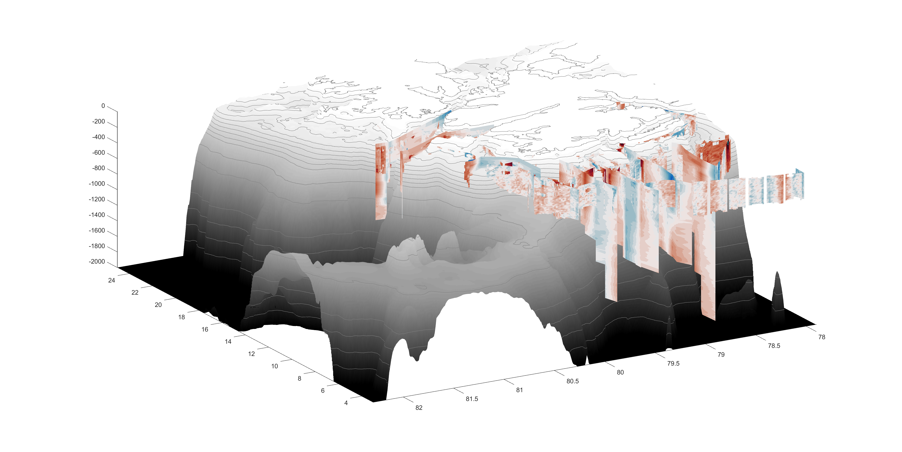
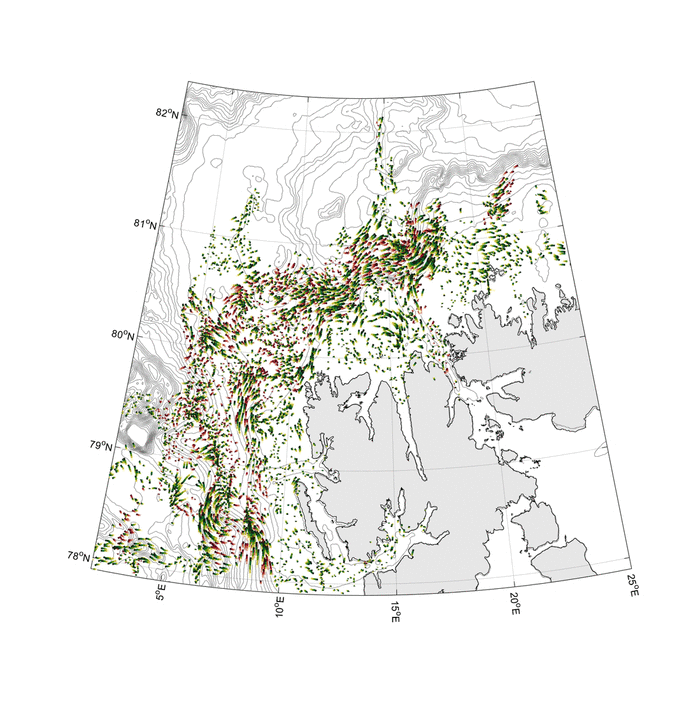

# Processing-and-analysis-of-large-ADCP-datasets
This document will guide you through the steps necessary to process and analyse both vessel mounted (VM-ADCP) and lowered acoustic doppler current profilers (L-ADCP). Both are complex data sources that contain a lot of noise and potential biases, but dont despair, with todays programms and code packages anyone can work with this data and produce meaningfull results. 

This tutorial will teach you how to make beautiful visualizations of ADCP data such as these:

